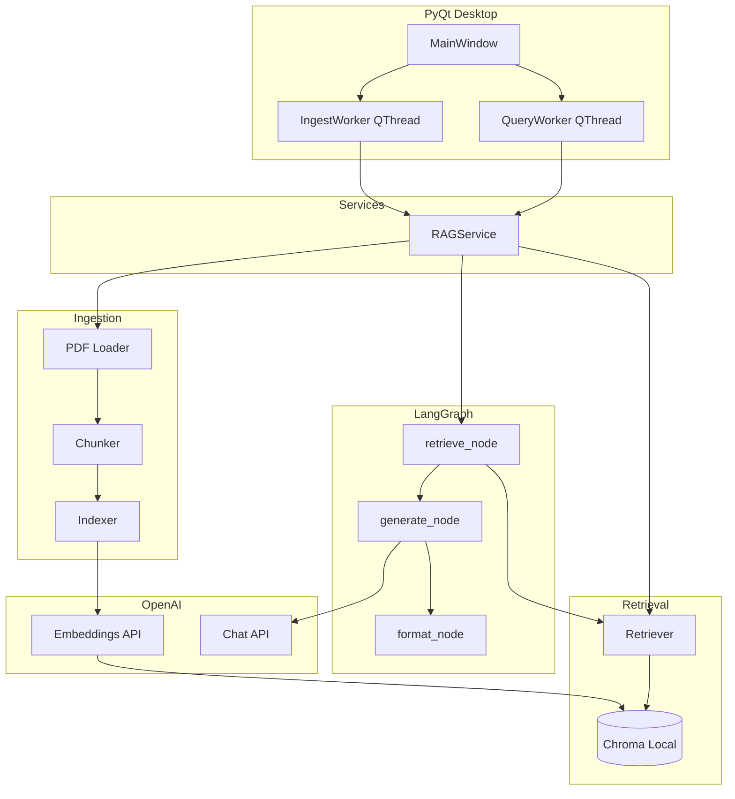
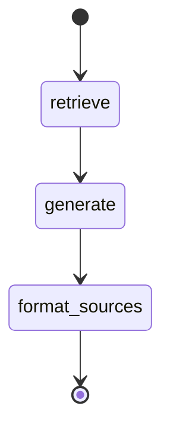

# Persian Tender-Document QA MVP — Implementation Roadmap

## 1. Recommended Project Structure

Keep a flat, module-oriented layout. Avoid premature packages until you have more than one agent or UI variant.

```
bidai/
├── .env.example                 # OPENAI_API_KEY, optional model names
├── .gitignore
├── README.md
├── pyproject.toml               # or requirements.txt (prefer pyproject.toml)
├── main.py                      # GUI entry point
│
├── config/
│   └── settings.py              # env loading, paths, model names, chunk params
│
├── core/
│   ├── models.py                # shared dataclasses / TypedDicts (Chunk, Source, QAState)
│   └── exceptions.py            # custom errors (PDFError, IndexError, APIError)
│
├── ingestion/
│   ├── pdf_loader.py            # PDF → raw text (Persian-aware)
│   ├── chunker.py               # text → LangChain Documents / chunks
│   └── indexer.py               # embed + persist to Chroma
│
├── retrieval/
│   ├── vector_store.py          # Chroma init, collection per document/session
│   └── retriever.py             # LangChain retriever wrapper + metadata filters
│
├── agent/
│   ├── state.py                 # LangGraph state schema
│   ├── nodes.py                 # retrieve, generate, format_sources
│   ├── graph.py                 # LangGraph workflow definition
│   └── prompts.py               # Persian system/user prompt templates
│
├── services/
│   ├── openai_client.py         # thin wrappers for embeddings + chat
│   └── rag_service.py           # orchestrates ingest + query (used by GUI thread)
│
├── ui/
│   ├── main_window.py           # PyQt main window
│   ├── widgets/
│   │   ├── file_picker.py
│   │   ├── chat_panel.py
│   │   └── sources_panel.py     # retrieved chunks display
│   └── workers.py               # QThread workers for ingest/query (non-blocking UI)
│
├── data/
│   ├── chroma/                  # local vector DB (gitignored)
│   └── uploads/                 # optional copy of processed PDFs (gitignored)
│
└── tests/
    ├── test_pdf_loader.py
    ├── test_chunker.py
    ├── test_indexer.py
    ├── test_retriever.py
    └── test_graph.py
```

**Why this structure**

| Layer | Responsibility |
|-------|----------------|
| `ingestion/` | PDF → chunks → vectors; no UI or agent logic |
| `retrieval/` | Chroma + retriever only |
| `agent/` | LangGraph state machine; easy to add tools later |
| `services/` | Glue for the GUI; keeps PyQt out of core logic |
| `ui/` | Presentation + background workers |

---

## 2. Minimum Viable Architecture



**MVP scope (in)**

- Single PDF per session (or per collection)
- One Chroma collection keyed by document ID / file hash
- Linear RAG graph: retrieve → generate → return
- Chat UI with optional source panel
- Env-based API key

**MVP scope (out)**

- Multi-document cross-search
- Auth, cloud deploy, user accounts
- OCR for scanned PDFs (document as limitation; add later)
- Tool-calling beyond RAG (stub hooks only)
- Streaming tokens in UI (nice-to-have; not blocking MVP)
- Persian reranker / hybrid search

---

## 3. LangGraph Design (Initial Agentic RAG Flow)

### State schema (`agent/state.py`)

```python
# Conceptual — not implementation
class QAState(TypedDict):
    question: str
    document_id: str
    retrieved_docs: list[Document]      # LangChain Document objects
    answer: str
    sources: list[dict]                 # {page, chunk_id, text_preview}
    messages: list[BaseMessage]         # for future multi-turn + tools
```

### Graph topology (MVP)



| Node | Role |
|------|------|
| `retrieve` | `retriever.invoke(question)` → `retrieved_docs` |
| `generate` | Build Persian prompt with context; call Chat API → `answer` |
| `format_sources` | Map chunks to UI-friendly `sources` |

**Entry:** `question` + `document_id`  
**Exit:** `answer` + `sources` (+ optional `messages` for history)

### Why LangGraph now (with a simple graph)

- Same state object can later branch to `tool_router` → `calculator`, `date_parser`, `compare_docs`, etc.
- Checkpointing and multi-turn chat are straightforward extensions
- Clear separation: retrieval and generation are distinct nodes

### Future extension (not in MVP)

```
START → router → [retrieve | tool_x | tool_y] → generate → END
```

Add a `router` node when you introduce non-RAG tools; MVP stays linear.

---

## 4. How Components Interact

### Data flow: Indexing

1. User picks PDF in PyQt → `IngestWorker` runs off the UI thread
2. `RAGService.index_pdf(path)`:
   - `pdf_loader` → raw text + page metadata
   - `chunker` → LangChain `Document` list (`page`, `source`, `chunk_index`)
   - `indexer` → OpenAI embeddings → Chroma `add_documents`
3. Worker emits `progress` / `finished(document_id)` → UI enables chat

### Data flow: Question answering

1. User sends question → `QueryWorker`
2. `RAGService.ask(question, document_id)`:
   - Invoke compiled LangGraph with initial state
   - Graph: retrieve → generate → format_sources
3. Worker emits `answer` + `sources` → chat panel + sources panel

### LangChain usage (practical, not exhaustive)

| Concern | LangChain piece |
|---------|-----------------|
| Documents | `Document` with metadata |
| Chunking | `RecursiveCharacterTextSplitter` (tuned separators) or custom Persian splitter |
| Embeddings | `OpenAIEmbeddings` |
| Vector store | `Chroma` via `langchain-chroma` |
| Retriever | `vectorstore.as_retriever(search_kwargs={"k": 4})` |
| Messages | `ChatOpenAI` + prompt templates |
| Graph | LangGraph `StateGraph` |

### PyQt threading rule

**Never call OpenAI or Chroma on the main thread.** Use `QThread` + signals:

- `ingest_progress(int, str)`
- `ingest_finished(str document_id)`
- `ingest_error(str)`
- `answer_ready(str answer, list sources)`
- `query_error(str)`

`RAGService` stays synchronous; workers wrap it.

### Configuration (`config/settings.py`)

- `OPENAI_API_KEY` from `.env` / environment
- `EMBEDDING_MODEL` (e.g. `text-embedding-3-small`)
- `CHAT_MODEL` (e.g. `gpt-4o-mini` for speed/cost)
- `CHROMA_PERSIST_DIR`, `CHUNK_SIZE`, `CHUNK_OVERLAP`, `TOP_K`

---

## 5. Development Phases

### Phase 0 — Project bootstrap (≈30 min)

**Build**

- `pyproject.toml` / `requirements.txt`
- `.env.example`, `.gitignore`
- `config/settings.py`
- Empty package skeleton + `main.py` stub

**Dependencies (minimal)**

```
python-dotenv
pymupdf          # fitz — strong for Persian PDF text
langchain
langchain-openai
langchain-chroma
langchain-text-splitters
chromadb
langgraph
PyQt6            # or PyQt5 if you prefer
```

**Output:** `python -c "from config.settings import settings"` works; API key loads.

**Test:** Run import smoke test; verify `.env` loading without committing secrets.

---

### Phase 1 — Persian PDF extraction (≈2–4 hours)

**Build**

- `ingestion/pdf_loader.py`
- `core/models.py` (e.g. `ExtractedPage`, `ExtractedDocument`)

**Behavior**

- Extract text per page with PyMuPDF
- Preserve `page_number`, `source_path`
- Normalize whitespace; keep Persian characters
- Return empty/short pages with a flag for debugging

**Output:** Function `load_pdf(path) -> ExtractedDocument`

**Test**

- Manual: 1–2 real tender PDFs; print first/last page samples
- Automated: `tests/test_pdf_loader.py` with a tiny fixture PDF (generate once, commit if small)
- Check: readable Persian, page count matches, no massive garbling

---

### Phase 2 — Chunking (≈1–2 hours)

**Build**

- `ingestion/chunker.py`

**Behavior**

- Convert pages → LangChain `Document`
- Split with overlap; prefer separators that respect Persian punctuation (`۔`, `؟`, `\n\n`, `.`)
- Metadata: `page`, `source`, `chunk_index`, `document_id`

**Suggested MVP params:** `chunk_size=800–1200`, `overlap=150–200` (tune on real docs)

**Output:** `chunk_document(extracted) -> list[Document]`

**Test**

- Chunks are non-empty, mostly complete sentences
- Metadata preserved
- No single chunk dominates entire doc

---

### Phase 3 — Embeddings + Chroma indexing (≈2–3 hours)

**Build**

- `services/openai_client.py`
- `ingestion/indexer.py`
- `retrieval/vector_store.py`

**Behavior**

- One collection per `document_id` (hash of path or UUID)
- `index_documents(docs, document_id)` → persist under `data/chroma/`
- Idempotent re-index: delete/recreate collection or upsert by chunk ID

**Output:** Searchable local vector store for a processed PDF

**Test**

- Index sample doc; query Chroma directly for a known phrase
- Re-run index on same file without corruption
- Confirm embedding dimension matches model

---

### Phase 4 — Retriever + basic RAG (no graph yet) (≈2 hours)

**Build**

- `retrieval/retriever.py`
- `agent/prompts.py`
- `services/rag_service.py` (retrieve + generate only)

**Behavior**

- Top-k retrieval (`k=4` default)
- Persian system prompt: answer only from context; say when unknown
- Return answer + raw retrieved docs

**Output:** CLI or simple script: `ask("مهلت ارسال پیشنهاد چیست؟")` → answer

**Test**

- 5–10 questions with known answers in the doc
- Hallucination check: question not in doc → should refuse or qualify
- Latency baseline (target: acceptable for desktop MVP)

---

### Phase 5 — LangGraph agent wrapper (≈1–2 hours)

**Build**

- `agent/state.py`, `agent/nodes.py`, `agent/graph.py`
- Refactor `rag_service.py` to call `graph.invoke()`

**Behavior**

- Same behavior as Phase 4, structured as graph
- `format_sources` builds UI-ready snippets (truncate ~200 chars)

**Output:** `compiled_graph.invoke({question, document_id})`

**Test**

- `tests/test_graph.py`: mock LLM/retriever or use recorded fixtures
- Output shape stable: `answer`, `sources`, `retrieved_docs`

---

### Phase 6 — PyQt GUI (≈4–6 hours)

**Build**

- `ui/main_window.py`
- `ui/widgets/chat_panel.py`, `sources_panel.py`, `file_picker.py`
- `ui/workers.py`
- `main.py`

**UI layout (simple)**

```
┌─────────────────────────────────────────────┐
│ [Select PDF]  [Process/Index]  Status: ...  │
├──────────────────────────┬──────────────────┤
│ Chat history             │ Retrieved sources│
│                          │ (collapsible)    │
├──────────────────────────┴──────────────────┤
│ [Question input................] [Send]     │
└─────────────────────────────────────────────┘
```

**Behavior**

- Disable chat until indexing completes
- Progress during ingest (page count or chunk count)
- Show answer in chat; sources in side panel with page numbers
- Error dialogs for API/PDF failures

**Output:** Runnable desktop app

**Test**

- Full manual E2E: upload → index → ask → see answer + sources
- UI stays responsive during 30s+ ingest (worker thread)
- Invalid PDF / missing API key handled gracefully

---

### Phase 7 — Polish & MVP hardening (≈2–3 hours)

**Build**

- README with setup/run steps
- `.env.example` documented
- Basic logging (`logging` to file/console)
- Optional: clear index / new document button

**Output:** Demo-ready MVP

**Test**

- Fresh machine setup from README
- One full tender doc demo script for stakeholders

---

## 6. Risks and Mitigations

| Risk | Impact | Mitigation (MVP) |
|------|--------|------------------|
| **Scanned/image PDFs** | Empty or garbage text | Detect low char count; show clear error: "OCR not supported in v1" |
| **Persian encoding / RTL** | Broken display in UI | PyMuPDF extraction; Qt RTL on chat widgets (`setLayoutDirection`); store logical Unicode |
| **PDF layout (tables, multi-column)** | Shuffled text | Accept imperfection in v1; preserve page numbers; consider `pdfplumber` fallback later |
| **Chunk boundaries** | Split mid-clause, lost context | Overlap 150–200; Persian-aware separators; slightly larger chunks |
| **Retrieval misses** | Wrong/no context | `k=4–6`; include page in metadata; show sources so user can judge |
| **LLM hallucination** | False tender answers | Strict Persian prompt: context-only; cite pages; refuse when insufficient |
| **Embedding–language mismatch** | Weaker Persian similarity | `text-embedding-3-small/large` OK for MVP; evaluate before custom models |
| **UI freeze** | Bad UX | All I/O in `QThread`; never block main thread |
| **API cost/latency** | Slow or expensive demos | `gpt-4o-mini`, small embedding model, cache collection locally |
| **Re-indexing same file** | Duplicate vectors | `document_id` from file hash; replace collection on re-process |
| **Large tenders (500+ pages)** | Slow ingest | Batch embed; progress bar; optional page limit for first demo |

---

## 7. Fastest Path to a Working MVP

**Critical path (≈1–2 days focused work):**

1. **Phase 0** — Bootstrap (30 min)
2. **Phase 1** — PDF loader validated on *your* real tender PDFs (blocker if text is bad)
3. **Phase 2 + 3** — Chunk + Chroma index (combined session)
4. **Phase 4** — RAG in a **5-line CLI script** before LangGraph or GUI
5. **Phase 5** — LangGraph wrap (thin refactor)
6. **Phase 6** — Minimal PyQt (file pick, index button, chat, sources)

**Defer until after first demo**

- Streaming responses
- Multi-turn memory (pass last N messages in state later)
- OCR pipeline
- Hybrid BM25 + vector search
- Fancy styling / i18n
- Packaging (PyInstaller)

**Day 1 milestone:** CLI RAG answers Persian questions from one tender PDF.  
**Day 2 milestone:** Same flow in PyQt with non-blocking workers.

---

## 8. Testing Strategy (Lightweight)

| Phase | Test type |
|-------|-----------|
| 1–2 | Unit tests + visual inspection of Persian text |
| 3 | Integration: embed + similarity search |
| 4–5 | Golden Q&A set (5 questions / 1 doc) |
| 6 | Manual E2E + UI responsiveness |
| All | One real tender PDF as regression fixture |

No CI requirement for MVP; add GitHub Actions later.

---

## 9. Extension Hooks (Design Now, Build Later)

- **`agent/nodes.py`:** add `tool_router` node without changing ingestion/retrieval
- **`QAState.messages`:** enable multi-turn chat
- **`retrieval/retriever.py`:** swap in hybrid or reranker
- **`ingestion/pdf_loader.py`:** OCR backend interface (`OcrLoader` subclass)
- **`services/rag_service.py`:** single facade for GUI/API/CLI entry points

---

## 10. Summary

| Decision | Choice |
|----------|--------|
| PDF extraction | PyMuPDF (primary) |
| Vector DB | Local persistent Chroma |
| Embeddings / chat | OpenAI via `langchain-openai` |
| Orchestration | LangChain documents/retriever + LangGraph linear RAG |
| GUI | PyQt6 + `QThread` workers |
| MVP graph | `retrieve → generate → format_sources` |
| Fastest validation | CLI RAG before GUI |

This plan keeps the MVP small, modular, and agent-ready without building tools, OCR, or multi-document search upfront. Phase 1 on real Persian tender PDFs is the main go/no-go gate before investing in UI polish.

When you want to start implementation, Phase 0 + Phase 1 is the right first coding step.
