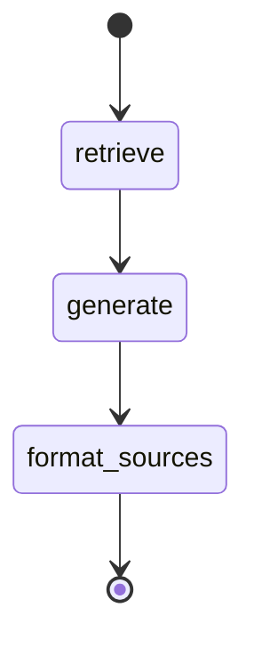

# Phase 5 — LangGraph Agent Wrapper Report

## Summary

Phase 5 wraps the existing Phase 4 retrieve-and-generate RAG flow inside a linear LangGraph workflow. The graph state schema, three orchestration nodes (`retrieve`, `generate`, `format_sources`), and a compiled graph API were implemented. `RAGService.ask()` now delegates to `compiled_graph.invoke()` while preserving the Phase 4 public API and `RAGAnswer` shape. Shared formatting and generation helpers were extracted to `services/rag_helpers.py` to avoid circular imports between the agent layer and the service layer. Unit tests use fake embeddings and a fake chat model — no real OpenAI API calls or API keys are required.

No PyQt UI, streaming, multi-turn memory, tool routing, or Phase 6 work was added.

## Files Created or Updated

| Path | Action |
|------|--------|
| `agent/state.py` | Updated — `QAState` TypedDict with LangGraph reducers |
| `agent/nodes.py` | Updated — `retrieve_node`, `generate_node`, `format_sources_node` |
| `agent/graph.py` | Updated — `build_rag_graph`, `get_compiled_rag_graph` |
| `services/rag_helpers.py` | Created — shared `format_*` and `generate_answer` helpers |
| `services/rag_service.py` | Updated — uses compiled LangGraph; re-exports helpers |
| `core/exceptions.py` | Updated — `GraphError`, `GraphInvocationError` |
| `tests/test_graph.py` | Updated — full LangGraph and integration test suite |
| `docs/phases/step-5.md` | Created — this report |

Phase 4 files reused without behavioral change: `agent/prompts.py`, `retrieval/retriever.py`, `services/openai_client.py`, `core/models.py` (`RAGAnswer`, `RAGSource`).

## LangGraph State Schema

**Module:** `agent/state.py`

```python
class QAState(TypedDict, total=False):
    question: str
    document_id: str
    retrieved_docs: Annotated[list[Document], _replace_list]
    answer: str
    sources: Annotated[list[dict], _replace_list]
    messages: Annotated[list[BaseMessage], _replace_list]
    top_k: int | None
    error: str | None
```

| Field | Set by | Description |
|-------|--------|-------------|
| `question` | Input / preserved | User question (stripped by `RAGService`) |
| `document_id` | Input / preserved | Indexed document identifier |
| `retrieved_docs` | `retrieve_node` | LangChain `Document` objects from Chroma |
| `answer` | `generate_node` | Final Persian answer text |
| `sources` | `format_sources_node` | UI-ready source dicts |
| `messages` | (reserved) | Optional; for future multi-turn support |
| `top_k` | Input (optional) | Retrieval count override |
| `error` | (reserved) | Optional; not used on the happy path — errors raise exceptions |

List fields use a replace reducer so each node overwrites its output cleanly.

## Graph Topology



**API:**

- `build_rag_graph(chat_model=..., embedding_function=..., persist_directory=...) -> StateGraph`
- `get_compiled_rag_graph(...) -> CompiledStateGraph`

**Invocation:**

```python
result = compiled_graph.invoke({
    "question": "مهلت ارسال پیشنهاد چیست؟",
    "document_id": "my-doc-id",
    "top_k": 4,  # optional
})
# result contains: question, document_id, retrieved_docs, answer, sources
```

## Node Responsibilities

### `retrieve_node`

- Reads `question`, `document_id`, and optional `top_k` from state.
- Calls `retrieve_documents()` from Phase 4 retriever.
- Stores results in `retrieved_docs`.
- Raises `EmptyQuestionError`, `InvalidDocumentIdError`, `CollectionNotFoundError`, `RetrievalError`, or `NoRetrievedDocumentsError` when applicable.
- Does **not** call the Chat API.

### `generate_node`

- Reads `question` and `retrieved_docs`.
- Calls `generate_answer()` which uses `RAG_PROMPT` from `agent/prompts.py` and `ChatOpenAI` (or injected fake model).
- Stores the Persian answer in `answer`.
- Preserves Phase 4 behavior: context-only answers, explicit refusal when unknown, no invented dates/prices/requirements.

### `format_sources_node`

- Reads `retrieved_docs`.
- Calls `format_sources()` and converts `RAGSource` dataclasses to dicts via `dataclasses.asdict`.
- Each source dict includes: `page`, `chunk_index`, `page_chunk_index` (if present), `source`, `file_name` (if present), `text_preview` (truncated to 200 characters).

## How `RAGService` Was Refactored

`RAGService.ask()` now:

1. Validates the question (`EmptyQuestionError` for empty input).
2. Builds initial graph state: `{question, document_id}` plus optional `top_k`.
3. Invokes a lazily compiled graph from `get_compiled_rag_graph()`, passing injected `chat_model`, `embedding_function`, and `persist_directory`.
4. Maps graph output back to `RAGAnswer`:
   - `answer` from state
   - `sources` from state dicts → `RAGSource` tuples
   - `retrieved_count` from `len(retrieved_docs)`
   - `model_name` from the chat model / settings
5. Re-raises `RAGError` and `RetrievalError` subclasses unchanged.
6. Wraps unexpected failures in `GraphInvocationError`.

The public constructor and `ask(question, document_id, *, top_k=None) -> RAGAnswer` signature are unchanged from Phase 4.

## How Phase 4 Behavior Was Preserved

| Concern | Preservation |
|---------|--------------|
| Persian prompts | Same `RAG_PROMPT` / system rules from `agent/prompts.py` |
| Retrieval | Same `retrieve_documents()` with top-k and metadata |
| Context formatting | Same `format_context_block()` (4000-char per-chunk cap) |
| Source formatting | Same `format_source()` / `format_sources()` (200-char previews) |
| Generation | Same `generate_answer()` logic extracted from Phase 4 `ask()` |
| Return type | Same `RAGAnswer` dataclass |
| Error types | Same retrieval/RAG exceptions; graph adds `GraphInvocationError` for unexpected failures |
| Tests | All 10 Phase 4 `test_rag_service.py` tests pass unchanged |

## Source Formatting Behavior

Unchanged from Phase 4:

- `text_preview`: truncated to 200 characters with `…` suffix
- Metadata mapped from LangChain `Document.metadata`: `page`, `chunk_index`, `page_chunk_index`, `source`, `file_name`
- In graph state, sources are `list[dict]` for UI/serialization convenience
- `RAGService` converts back to `tuple[RAGSource, ...]` for the public API

## Error Handling Added

| Exception | Base | When raised |
|-----------|------|-------------|
| `GraphError` | `BidaiError` | Base for LangGraph workflow failures |
| `GraphInvocationError` | `GraphError` | Unexpected failure during `graph.invoke()` |

Existing exceptions reused (unchanged behavior):

| Exception | When raised |
|-----------|-------------|
| `EmptyQuestionError` | Empty or whitespace-only question |
| `InvalidDocumentIdError` | Empty document ID |
| `InvalidTopKError` | Non-positive `top_k` |
| `CollectionNotFoundError` | No indexed collection for document |
| `NoRetrievedDocumentsError` | Retrieval returned zero chunks |
| `RetrievalError` | Retriever invocation failure |
| `ChatAPIError` | Chat model invocation failure |

The `error` field in `QAState` is reserved for future soft-error handling; the MVP path raises exceptions to match Phase 4.

## Test Cases Added

### `tests/test_graph.py`

| Test | Coverage |
|------|----------|
| `test_build_rag_graph_succeeds` | Graph builds without error |
| `test_get_compiled_rag_graph_succeeds` | Compiled graph has `invoke` |
| `test_retrieve_node_stores_retrieved_docs` | Retrieve node populates `retrieved_docs` |
| `test_retrieve_node_raises_on_empty_question` | `EmptyQuestionError` |
| `test_retrieve_node_raises_when_no_docs_returned` | `NoRetrievedDocumentsError` |
| `test_generate_node_stores_answer` | Generate node populates `answer` |
| `test_generate_node_raises_chat_api_error` | `ChatAPIError` on model failure |
| `test_format_sources_node_creates_ui_ready_sources` | Source dict fields |
| `test_format_sources_node_matches_rag_source_asdict` | Consistency with `format_sources()` |
| `test_compiled_graph_invoke_returns_expected_fields` | Full invoke output shape |
| `test_compiled_graph_flow_order` | Nodes run retrieve → generate → format_sources |
| `test_compiled_graph_unknown_document_raises` | `CollectionNotFoundError` |
| `test_rag_service_ask_still_returns_rag_answer` | `RAGService` integration |
| `test_rag_service_graph_invocation_error` | `GraphInvocationError` wrapping |

**Test helpers:** `tests/fake_embeddings.py`, `tests/fake_chat.py` (no OpenAI API key required).

`tests/test_rag_service.py` required no changes — all Phase 4 tests pass against the graph-backed service.

## Commands Used for Smoke Tests and Unit Tests

### Settings import

```bash
PYTHONPATH=. python -c "from config.settings import settings; print(settings)"
```

### Phase 0 smoke tests

```bash
PYTHONPATH=. pytest tests/test_smoke.py -v
```

### Phase 1–4 regression

```bash
PYTHONPATH=. pytest tests/test_pdf_loader.py tests/test_chunker.py tests/test_vector_store.py tests/test_indexer.py tests/test_retriever.py tests/test_rag_service.py -v
```

### Phase 5 graph tests

```bash
PYTHONPATH=. pytest tests/test_graph.py -v
```

### Full suite

```bash
PYTHONPATH=. pytest -v
```

## Test Results

| Command | Result |
|---------|--------|
| Settings import | **PASS** — defaults: `gpt-4o-mini`, `top_k=4`, `data/chroma` |
| `pytest tests/test_smoke.py tests/test_pdf_loader.py tests/test_chunker.py tests/test_vector_store.py tests/test_indexer.py tests/test_retriever.py tests/test_rag_service.py tests/test_graph.py -v` | **PASS** — 80 passed, 0 failed |
| `pytest -v` | **PASS** — 80 passed, 0 failed |

## Assumptions and Deviations

1. **`services/rag_helpers.py` extraction** — Formatting and generation helpers were moved out of `rag_service.py` into a shared module to break a circular import (`rag_service` → `agent.graph` → `agent.nodes` → helpers). `rag_service.py` re-exports them for backward compatibility with existing tests.
2. **Sources as dicts in graph state** — Roadmap suggests `list[dict]` in state; `RAGService` converts back to `RAGSource` for the public API.
3. **`error` state field reserved** — Included in schema for future use; MVP continues to raise exceptions like Phase 4.
4. **`messages` state field reserved** — Included for future multi-turn support; not populated in Phase 5.
5. **Graph compiled once per `RAGService` instance** — Lazy compilation on first `ask()`; dependencies are fixed at construction time.
6. **`PYTHONPATH=.` for local runs** — Same approach as Phases 1–4.

## Known Limitations

- **No streaming** — Full answer returned synchronously after graph completes.
- **No multi-turn memory** — `messages` field exists but is not used; each `ask()` is stateless.
- **No tool routing** — Linear graph only; no `router` node or tool branches.
- **No checkpointing** — Graph state is not persisted between invocations.
- **Compiled graph not rebuilt on dependency change** — If `chat_model` were swapped after first `ask()`, the cached graph would be stale (not an issue for current constructor usage).
- **Fake embeddings do not model semantic similarity** — Same limitation as Phases 3–4 tests.

## What Remains for Phase 6

Phase 6 — **PyQt GUI**:

- Implement `ui/main_window.py`, `ui/widgets/chat_panel.py`, `sources_panel.py`, `file_picker.py`
- Implement `ui/workers.py` — `QThread` workers for ingest and query
- Wire `main.py` as the desktop entry point
- Disable chat until indexing completes; show progress during ingest
- Display answers in chat panel and sources in side panel
- Error dialogs for API/PDF failures
- Manual E2E: upload → index → ask → see answer + sources with responsive UI
